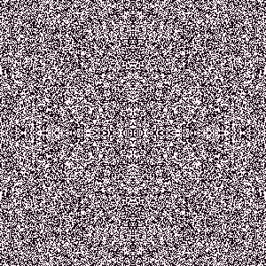
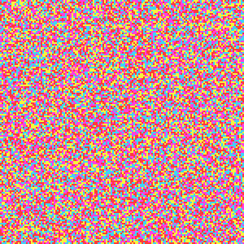
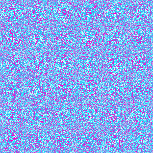
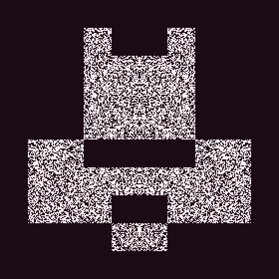

<h1 align="center">automaty.cell</h1>

<p align="center">
  10<sup>38</sup> cellular automata → GIFs, PNGs and video-mapping sequences,<br>
  from the command line, a web page or your AI agent (MCP)<br>
  <sub>rules × seeds × symmetries × shapes × palettes, before density, grid size or your own colours</sub>
</p>

<p align="center"><sub>v0.3.0 · Go 1.22+ · zero dependencies · MIT</sub></p>

<p align="center">
  <a href="#the-three-above">Examples</a> ·
  <a href="#on-your-own-image">On an image</a> ·
  <a href="#what-it-does">Features</a> ·
  <a href="#web-page">Web page</a> ·
  <a href="#agents-mcp">Agents</a> ·
  <a href="OPTIONS.md">Options</a>
</p>

<table align="center">
  <tr>
    <td align="center"><br><sub>Globe, mirrored into four</sub></td>
    <td align="center"><br><sub>Cyclic, custom colours</sub></td>
    <td align="center"><br><sub>Cyclic → Majority → cyclic, with <code>-at</code></sub></td>
  </tr>
</table>

Procedural images (PNG), animations (GIF) and image sequences (ZIP) from 2D
cellular automata, as a command-line tool, a web page and an MCP server for
agents.

```
go build -o automaty.cell .
```

## The three above

```
# Larger than Life (Globe), mirrored into four
./automaty.cell -rule globe -symmetry 4 -density 0.5 -w 300 -h 300 -scale 1 -gens 120 -delay 6 -palette candy -o blobs.gif

# A cyclic automaton in custom colours
./automaty.cell -cyclic -states 4 -threshold 3 -neighborhood moore -w 150 -h 150 -gens 120 -delay 6 -colors ff3b3b,ff3ee0,f7f33c,3ed4f7 -o swirls.gif

# Changes during the run: cyclic chaos melts into Majority blobs, then ripples out again
./automaty.cell -cyclic -states 8 -threshold 2 -neighborhood moore -w 300 -h 300 -scale 1 -gens 150 -delay 6 -palette cyber -at '50:rule=majority 90:cyclic=true 90:threshold=3 90:states=5' -o melt.gif
```

## On your own image

Any PNG or JPEG becomes a mask: the automaton only lives in its light areas (or
its opaque ones, for a cut-out logo), ready to map onto a façade or a logo.

<table align="center">
  <tr>
    <td align="center"><br><sub>The image</sub></td>
    <td align="center"><br><sub>The automaton, kept inside it</sub></td>
  </tr>
</table>

```
./automaty.cell -rule=B368/S125 -seed=213602 -symmetry=8 -density=0.47 -gens=75 -delay=3 -w=280 -h=280 -colors='f3bfc4,e4d470,43cf27,18816c' -mask=spaceship.png -o spaceship.gif
```

## What it does

- **Rules**: any B/S rule (Game of Life and co, in Golly's notation), Generations,
  Larger than Life over big neighbourhoods, and cyclic automata. 21 named presets
  (`-list-rules`).
- **Starts**: random or Perlin noise islands, mirror and rotation symmetries,
  shapes (disc, ring, spiral…), methuselahs, or an image mask to map onto a façade.
- **Changes during the run** with `-at`: switch the rule, palette or edges at a
  given generation while the cells carry on.
- **Output**: the last generation as PNG, an animated GIF (back-and-forth loops
  with `-pingpong`), or one PNG per generation in a ZIP for Resolume, MadMapper,
  TouchDesigner… 23 palettes, or your own colours.

Every option in one sentence: [OPTIONS.md](OPTIONS.md); defaults: `./automaty.cell -h`.

## Web page

```
./automaty.cell -serve :8080
```

Every option has its field and the image re-renders on every change, with its
command line below. **? RANDOM** picks lively settings, **Mutate** explores the
neighbours of a rule you like, and the page's link holds its settings, to share
a creation. Same engine as the CLI, with limits for online use (grids up to
500×500, GIFs up to about 80 MB).

## Agents (MCP)

`-mcp` serves the [Model Context Protocol](https://modelcontextprotocol.io) on
stdin/stdout: describe what you want to an agent and it renders it. Its one
tool, `render`, takes the CLI options, writes the file, and shows the agent a
contact sheet of 6 generations with a verdict (died out, frozen, fills the
grid…) so it can adjust. Same limits as the web page.

```
claude mcp add automaty -- /path/to/automaty.cell -mcp
```

For Claude Desktop, in `claude_desktop_config.json`:

```json
{ "mcpServers": { "automaty": { "command": "/path/to/automaty.cell", "args": ["-mcp"] } } }
```

## Tests

```
go test ./...
```

## License

MIT, see [LICENSE](LICENSE).
